<picture>
  <source media="(prefers-color-scheme: dark)" srcset="./assets/profile-hero-dark.svg">
  <source media="(prefers-color-scheme: light)" srcset="./assets/profile-hero-light.svg">
  
</picture>

---

  

---

# Projects

| Project | Description | Live |
|---------|-------------|------|
| 🚀 UISEN | Modern UI Component Library | https://uisen-io.vercel.app |
| 💬 Sampark | Real Time Chat Platform | https://sampark-inky.vercel.app |
| 🎬 InfiMotionX | Motion Animation Platform | https://infi-motion-x.vercel.app |
| 🌿 Greenaria Buildtech | Company Website | https://greenaria-buildtech.vercel.app |
| 🎮 PS5 Trailer Platform | Coming Soon | Soon |

---

# ⚙️ Tech Stack

## Languages

## Frontend

## Backend

## Tools

## Animation

GSAP • Motion • OGL • WebGL

---

# 💼 Experience

## Full Stack Developer Intern

### Coding Thinker

- Built production-ready web applications
- Developed reusable UI components
- Created REST APIs
- Performance Optimization
- Code Refactoring
- Bug Fixing
- Git Collaboration

---

### Greenaria Buildtech Pvt. Ltd.

- Full Stack Development
- Frontend Architecture
- Backend APIs
- Database Design
- Authentication
- Responsive UI
- Performance Improvements

---

# 🌟 Featured Projects

## 🚀 UISEN

Modern React UI Component Library

### Features

- Reusable Components
- Responsive
- Copy Code
- Tailwind
- Dark Mode
- Modern Design

🔗 https://uisen-io.vercel.app

---

## 💬 Sampark

Real Time Communication Platform

### Built With

- Next.js
- Socket.io
- MongoDB
- Firebase
- Authentication
- Responsive Design

🔗 https://sampark-inky.vercel.app

---

# 📊 GitHub Analytics

---

# 📈 Contribution Graph

---

# 🐍 Contribution Snake

> **Create the GitHub Action first (see below), then this image will work.**

---

# 🎓 Education

**B.Tech**

Computer Science Engineering

Technocrats Institute of Technology

CGPA **7.9**

---

### ⭐ If you like my work, consider starring my repositories!

